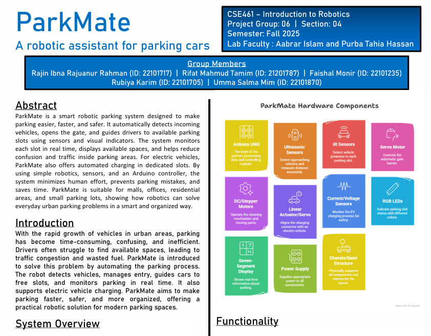
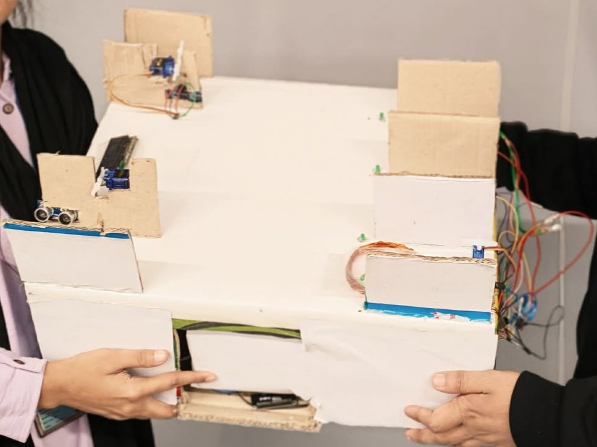

# ParkMate - A Robotic Assistant for Parking Cars

## CSE461: Introduction to Robotics [ FALL 2025 ]


ParkMate is a CSE461 robotics project that demonstrates a smart robotic parking assistant.  
The system detects vehicles, opens and closes gates automatically, monitors parking-slot availability, gives visual guidance, supports an EV charging slot, and logs parking status through a dashboard system.

<p align="center">
  
</p>

<p align="center">
  
  
</p>

---

## Table of Contents

- [Repository Highlights](#repository-highlights)
- [Project: ParkMate](#project-parkmate)
- [Course Information](#course-information)
- [Project Overview](#project-overview)
- [System Architecture](#system-architecture)
- [Features](#features)
- [Hardware Components](#hardware-components)
- [Communication Protocols Used](#communication-protocols-used)
- [System Workflow](#system-workflow)
- [Pin / Connection Configuration](#pin--connection-configuration)
- [Required Arduino Libraries](#required-arduino-libraries)
- [Dashboard and Data Logging](#dashboard-and-data-logging)
- [Repository Structure](#repository-structure)
- [Project Files](#project-files)
- [Project Group Members](#project-group-members)
- [Future Work](#future-work)
- [License](#license)

---

## Repository Highlights

- Three-slot smart parking prototype built for **CSE461: Introduction to Robotics**
- Automatic vehicle detection at entry and exit gates using ultrasonic sensors
- Automatic gate opening and closing using servo motors
- Real-time parking-slot detection using IR sensors
- LED-based slot guidance for available and occupied parking spaces
- I2C LCD display for showing car count and available parking slots
- EV charging support for Slot 1 using a relay-based control system
- Automated dashboard/data logging support using ESP8266 and spreadsheet logging
- Slot-cleaning concept using servo motors and a DC motor
- Includes final report, project poster, prototype image, Fritzing circuit diagram, dashboard spreadsheet, and lab files

---

## Project: ParkMate

**ParkMate** is a robotic assistant for parking cars. It is designed to make parking easier, faster, safer, and more organized in small to medium parking areas.

The prototype uses an **Arduino UNO** as the main controller. Sensors detect incoming cars, outgoing cars, and slot occupancy. Based on the sensor readings, the system controls gates, LEDs, display output, EV charging status, and cleaning actuators. The project shows how robotics concepts such as sensing, decision-making, actuation, and automation can solve a real-world parking problem.

---

## Course Information

**Course:** CSE461: Introduction to Robotics  
**Offered:** Fall 2025  
**Pre-requisite:** CSE260, CSE341, CSE360  
**Semester:** Fall 2025  
**Section:** 04  
**Project Group:** 06  

This course introduces robotics by discussing basic laws, architectures, control systems, perceiving techniques, and communication. It also investigates kinematics, motor action, mechanical engineering issues, advanced communication protocols, and uses of AI in robotics.

---

## Project Overview

Parking has become a major problem in busy urban areas because the number of vehicles is increasing while parking space is limited. Drivers often waste time and fuel searching for an empty parking slot. Manual parking systems also depend heavily on human monitoring and do not always provide real-time slot information.

ParkMate solves this problem by automating the main parking tasks. The system detects a vehicle near the gate, opens the gate automatically, checks available slots, guides the driver using LEDs, updates the LCD display, and records parking information in a dashboard log. It also includes EV charging support for one slot and a simple automated slot-cleaning concept.

---

## System Architecture

ParkMate follows a simple robotics architecture with three main layers:

| Layer | Components | Function |
|---|---|---|
| Input Layer | HC-SR04 ultrasonic sensors, IR slot sensors | Detect cars at entry/exit gates and detect slot occupancy |
| Processing Layer | Arduino UNO, ESP8266 | Read sensor data, make decisions, control outputs, send dashboard data |
| Output Layer | Servo motors, DC motor, relay module, LEDs, LCD | Open/close gates, show slot status, control EV charging, display parking data |

---

## Features

- Automatic entry-gate detection and gate control
- Automatic exit-gate detection and gate control
- Three-slot parking availability monitoring
- IR sensor-based car detection for each slot
- LED guidance system for showing available or occupied slots
- LCD display showing total cars and free parking spaces
- Slot 1 EV charging support using a relay-controlled charging system
- ESP8266-based automated dashboard/data transfer concept
- Google Spreadsheet / Excel-based parking log support
- Cleaning mechanism using servo motors for Slot 1 and Slot 2
- DC motor-based cleaning mechanism for Slot 3
- Low-cost and modular prototype design

---

## Hardware Components

| Component | Quantity / Use | Purpose |
|---|---:|---|
| Arduino UNO | 1 | Main microcontroller for decision-making and control |
| ESP8266 | 1 | Sends parking data to the automated dashboard system |
| HC-SR04 Ultrasonic Sensor | 2 | Detects cars at entry and exit gates |
| IR Sensor Module | 3 | Detects whether each parking slot is occupied or empty |
| SG90 Servo Motor | 5 | Controls entry/exit gates and slot-cleaning mechanisms |
| DC Motor | 1 | Used for Slot 3 cleaning actuator |
| 5V Relay Module | 1+ | Controls EV charging / external load switching |
| 16x2 I2C LCD | 1 | Displays car count and available slots |
| RGB / Status LEDs | Multiple | Shows slot availability and system state |
| Resistors, Diode, Transistor | As required | Protects and controls circuit connections |
| Breadboard and Jumper Wires | As required | Builds and connects the prototype circuit |
| 5V / 12V DC Power Supply | 1 | Provides stable power for motors and modules |
| Acrylic / Plywood Base | 1 | Holds the parking-lot prototype structure |

---

## Communication Protocols Used

| Protocol / Method | Used For |
|---|---|
| Digital GPIO | Ultrasonic sensors, IR sensors, LEDs, relay control |
| PWM | Servo motor control and motor actuation |
| I2C | 16x2 LCD display communication |
| UART / Serial-style Communication | Arduino and ESP8266 data transfer concept |
| Wi-Fi / HTTP | ESP8266 dashboard and spreadsheet logging concept |
| Relay Switching | EV charging control and load isolation |

---

## System Workflow

1. The system powers on and initializes the Arduino, sensors, LCD, motors, and dashboard module.
2. The entry ultrasonic sensor checks whether a car is near the entry gate.
3. If a car is detected, the Arduino opens the entry gate using a servo motor.
4. The Arduino reads the three IR sensors to check which parking slots are free.
5. Available slots are shown using LEDs and updated on the LCD display.
6. When a car enters a slot, the related IR sensor changes its reading.
7. The system updates the slot status from available to occupied.
8. Slot 1 supports EV charging through a relay-controlled charging system.
9. Parking data can be transferred to the dashboard/log file using the ESP8266 module.
10. The exit ultrasonic sensor detects outgoing cars and opens the exit gate.
11. The LCD and dashboard log are updated after every parking status change.

---

## Pin / Connection Configuration

The exact wiring is documented in the included Fritzing file:

```text
Project-ParkMate-A_Robotic_Assistant_for_Parking_Cars/461project circuit diagram.fzz
```

Main prototype connections:

| Module | Arduino / Circuit Connection |
|---|---|
| Entry HC-SR04 Sensor | Digital trigger and echo pins |
| Exit HC-SR04 Sensor | Digital trigger and echo pins |
| Slot 1 IR Sensor | Digital input pin |
| Slot 2 IR Sensor | Digital input pin |
| Slot 3 IR Sensor | Digital input pin |
| Entry Gate Servo | PWM-capable digital pin |
| Exit Gate Servo | PWM-capable digital pin |
| Slot 1 Cleaning Servo | PWM-capable digital pin |
| Slot 2 Cleaning Servo | PWM-capable digital pin |
| Slot 3 DC Motor | Relay / transistor driver circuit |
| EV Charging Relay | Relay signal control pin |
| Status LEDs | Digital output pins through resistors |
| I2C LCD SDA | Arduino A4 |
| I2C LCD SCL | Arduino A5 |
| ESP8266 | Serial / data communication pins with common ground |
| Power Modules | 5V / 12V supply with common ground |

> Before uploading final code, verify the exact pin numbers from the Fritzing circuit diagram and match them with the Arduino sketch.

---

## Required Arduino Libraries

Install the required libraries in Arduino IDE depending on the modules used in the final sketch:

```cpp
#include <Wire.h>
#include <LiquidCrystal_I2C.h>
#include <Servo.h>
```

For ESP8266 dashboard or internet-based logging, the ESP8266 board package and Wi-Fi libraries may also be required:

```cpp
#include <ESP8266WiFi.h>
#include <ESP8266HTTPClient.h>
```

---

## Dashboard and Data Logging

The project folder includes:

```text
SmartParkingLog.xlsx
```

This spreadsheet contains a dashboard and a parking log. The log tracks values such as:

- Timestamp
- Available Slots
- Occupied Slots
- Slot 1 EV status
- Slot 2 status
- Slot 3 status
- EV Relay Status

This supports the automated dashboard concept mentioned in the project report.

---

## Repository Structure

```text
.
├── README.md
├── LICENSE
├── LAB-1/
│   ├── CSE461 Lab Report Template.pdf
│   ├── CSE461 Lab Worksheet 1.pdf
│   ├── LAB-1 CODE.pdf
│   ├── TASK-3/TASK-3.ino
│   └── lab images
├── LAB-2/
│   ├── CSE461 Lab Report-2.pdf
│   ├── CSE461 Lab Worksheet 2.pdf
│   ├── Setting up Raspberry PI.pdf
│   ├── Lab-2_Evaluation/Lab-2_Evaluation.ino
│   └── lab images
├── LAB-3/
│   ├── CSE461 Lab Report-3 .pdf
│   ├── CSE461 Lab Worksheet 3.pdf
│   ├── Setting up Arduino IDE in Raspberry PI.pdf
│   ├── Lab-3_Evaluation/Lab-3_Evaluation.ino
│   └── lab images
├── LAB-4/
│   ├── CSE461 Lab Report-4.pdf
│   ├── CSE461 Lab Worksheet 4.pdf
│   ├── CSE461 Lab-4 Report.pdf
│   └── lab images
├── LAB-5/
│   ├── CSE461 Lab Report-5.pdf
│   ├── CSE461 Lab Worksheet 5.pdf
│   ├── Black and White Zone.pdf
│   ├── labcode.py
│   └── lab images
├── LAB-6/
│   ├── CSE461 Lab Worksheet 6.pdf
│   ├── evaluation code.py
│   └── lab images
├── LAB-7/
│   ├── CSE461 Lab Worksheet 7.pdf
│   ├── LAB-7 CODE.pdf
│   └── lab images
├── LAB-Evaluation/
│   ├── CSE461 Lab Worksheet 8.docx.pdf
│   ├── _CSE461 Lab Report-8 Template.pdf
│   ├── LAb evaluation_bb.jpg
│   └── evaluation images
└── Project-ParkMate-A_Robotic_Assistant_for_Parking_Cars/
    ├── 461project circuit diagram.fzz
    ├── 461project circuit diagram_bb.jpg
    ├── F25_CSE461_4_6_1.pdf
    ├── Park-Mate-Group-06.pdf
    ├── Project_img.jpg
    ├── project_poster.png
    └── SmartParkingLog.xlsx
```

---

## Project Files

| File | Description |
|---|---|
| `Project-ParkMate-A_Robotic_Assistant_for_Parking_Cars/F25_CSE461_4_6_1.pdf` | Final lab project report |
| `Project-ParkMate-A_Robotic_Assistant_for_Parking_Cars/Park-Mate-Group-06.pdf` | Project poster / one-page presentation |
| `Project-ParkMate-A_Robotic_Assistant_for_Parking_Cars/project_poster.png` | Poster image used in this README |
| `Project-ParkMate-A_Robotic_Assistant_for_Parking_Cars/Project_img.jpg` | Hardware prototype image |
| `Project-ParkMate-A_Robotic_Assistant_for_Parking_Cars/461project circuit diagram_bb.jpg` | Breadboard circuit diagram image |
| `Project-ParkMate-A_Robotic_Assistant_for_Parking_Cars/461project circuit diagram.fzz` | Editable Fritzing circuit file |
| `Project-ParkMate-A_Robotic_Assistant_for_Parking_Cars/SmartParkingLog.xlsx` | Smart parking dashboard and data log spreadsheet |
| `LAB-1` to `LAB-Evaluation` | Course lab reports, worksheets, codes, and hardware images |
| `LICENSE` | MIT license file |

---

## Project Group Members

[Rifat Mahmud Tamim](https://github.com/RIFAT-MAHMUD-TAMIM-00) |[Rajin Ibna Rajuanur Rahman](https://github.com/rajin50) | [Umma Salma Mim](https://github.com/ummasalmamim) | [Rubiya Karim](https://www.facebook.com/rubaiya.karim.1) | [Faishal Monir](https://github.com/Faishal-Monir)


---

## Future Work

- Add a more accurate exit sensor system for real-time car counting
- Add a larger display sign for showing specific available slots
- Improve wireless monitoring for remote parking status checking
- Expand the prototype from three slots to a larger parking system
- Improve EV charging safety for real-world implementation
- Add stronger mechanical protection and better motor drivers
- Improve sensor calibration for different lighting and surface conditions

---

## License

This repository is released under the **MIT License**.

This project was developed for academic purposes as part of **CSE461: Introduction to Robotics** at **BRAC University**.